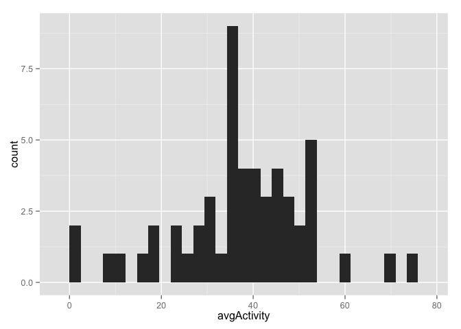

# Reproducible Research: Peer Assessment 1

## Install and Load Libraries

```r
# Auto Install Packages
list.of.packages <- c("dplyr", "ggplot2", "knitr")
new.packages <- list.of.packages[!(list.of.packages %in% installed.packages()[,"Package"])]

if(length(new.packages)) install.packages(new.packages)

## Bring in the libs.
library(dplyr)
```

```
## 
## Attaching package: 'dplyr'
## 
## The following object is masked from 'package:stats':
## 
##     filter
## 
## The following objects are masked from 'package:base':
## 
##     intersect, setdiff, setequal, union
```

```r
library(ggplot2)
library(knitr)
```

## Loading and preprocessing the data

```r
    activity <- read.csv((unz("activity.zip", "activity.csv")))
    activity <- activity %>%
        mutate(date = as.Date(date))
```


## What is mean total number of steps taken per day?

```r
    daily_activity <- activity %>%
        filter(!is.na(steps)) %>%
        group_by(date) %>%
        summarise(avgActivity = mean(steps, na.rm = TRUE))

    g <- ggplot(data = daily_activity, aes(avgActivity)) + 
        geom_histogram()
    print(g)
```

 

## What is the average daily activity pattern?


## Imputing missing values


## Are there differences in activity patterns between weekdays and weekends?
