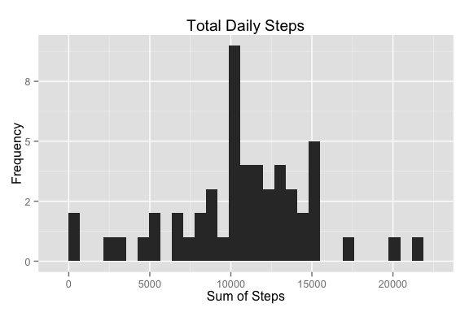
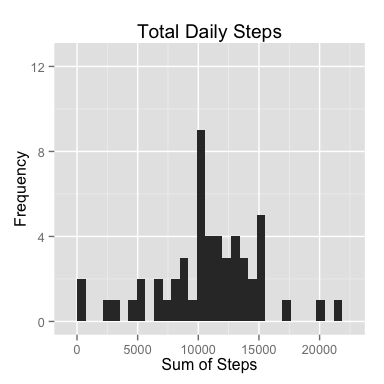
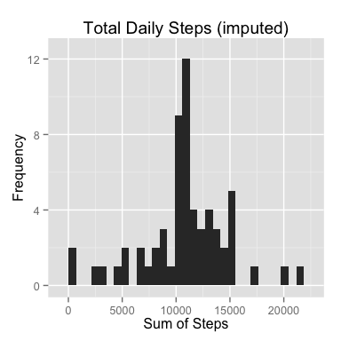

# Reproducible Research: Peer Assessment 1

## Install and Load Libraries

```r
# Auto Install Packages
list.of.packages <- c("dplyr", "ggplot2", "knitr")
new.packages <- list.of.packages[!(list.of.packages %in% installed.packages()[,"Package"])]

if(length(new.packages)) install.packages(new.packages)

## Bring in the libs.
library(dplyr)
library(ggplot2)
library(knitr)

## Knitr setup for rounding:
options(scipen = 1, digits = 1)
```

## Loading and preprocessing the data

```r
# Load the data from CSV
activity <- read.csv((unz("activity.zip", "activity.csv")))

# Turn the date column into actual dates.    
activity <- activity %>%
    mutate(date = as.Date(date))

# Create a clean activity data frame, 
# excluding missing values for later use.
clean_activity <- filter(activity, !is.na(steps))
```

***

## What is mean total number of steps taken per day?
##### 1. Calculate the total number of steps taken per day.

I am including an output table below to show that I have calculated the total # of steps taken per day.


```r
total_da <- clean_activity %>%
    group_by(date) %>%
    summarise(sum_steps = sum(steps))    

kable(total_da, digits=1, row.names = FALSE, format="html")
```

<table>
 <thead>
  <tr>
   <th style="text-align:left;"> date </th>
   <th style="text-align:right;"> sum_steps </th>
  </tr>
 </thead>
<tbody>
  <tr>
   <td style="text-align:left;"> 2012-10-02 </td>
   <td style="text-align:right;"> 126 </td>
  </tr>
  <tr>
   <td style="text-align:left;"> 2012-10-03 </td>
   <td style="text-align:right;"> 11352 </td>
  </tr>
  <tr>
   <td style="text-align:left;"> 2012-10-04 </td>
   <td style="text-align:right;"> 12116 </td>
  </tr>
  <tr>
   <td style="text-align:left;"> 2012-10-05 </td>
   <td style="text-align:right;"> 13294 </td>
  </tr>
  <tr>
   <td style="text-align:left;"> 2012-10-06 </td>
   <td style="text-align:right;"> 15420 </td>
  </tr>
  <tr>
   <td style="text-align:left;"> 2012-10-07 </td>
   <td style="text-align:right;"> 11015 </td>
  </tr>
  <tr>
   <td style="text-align:left;"> 2012-10-09 </td>
   <td style="text-align:right;"> 12811 </td>
  </tr>
  <tr>
   <td style="text-align:left;"> 2012-10-10 </td>
   <td style="text-align:right;"> 9900 </td>
  </tr>
  <tr>
   <td style="text-align:left;"> 2012-10-11 </td>
   <td style="text-align:right;"> 10304 </td>
  </tr>
  <tr>
   <td style="text-align:left;"> 2012-10-12 </td>
   <td style="text-align:right;"> 17382 </td>
  </tr>
  <tr>
   <td style="text-align:left;"> 2012-10-13 </td>
   <td style="text-align:right;"> 12426 </td>
  </tr>
  <tr>
   <td style="text-align:left;"> 2012-10-14 </td>
   <td style="text-align:right;"> 15098 </td>
  </tr>
  <tr>
   <td style="text-align:left;"> 2012-10-15 </td>
   <td style="text-align:right;"> 10139 </td>
  </tr>
  <tr>
   <td style="text-align:left;"> 2012-10-16 </td>
   <td style="text-align:right;"> 15084 </td>
  </tr>
  <tr>
   <td style="text-align:left;"> 2012-10-17 </td>
   <td style="text-align:right;"> 13452 </td>
  </tr>
  <tr>
   <td style="text-align:left;"> 2012-10-18 </td>
   <td style="text-align:right;"> 10056 </td>
  </tr>
  <tr>
   <td style="text-align:left;"> 2012-10-19 </td>
   <td style="text-align:right;"> 11829 </td>
  </tr>
  <tr>
   <td style="text-align:left;"> 2012-10-20 </td>
   <td style="text-align:right;"> 10395 </td>
  </tr>
  <tr>
   <td style="text-align:left;"> 2012-10-21 </td>
   <td style="text-align:right;"> 8821 </td>
  </tr>
  <tr>
   <td style="text-align:left;"> 2012-10-22 </td>
   <td style="text-align:right;"> 13460 </td>
  </tr>
  <tr>
   <td style="text-align:left;"> 2012-10-23 </td>
   <td style="text-align:right;"> 8918 </td>
  </tr>
  <tr>
   <td style="text-align:left;"> 2012-10-24 </td>
   <td style="text-align:right;"> 8355 </td>
  </tr>
  <tr>
   <td style="text-align:left;"> 2012-10-25 </td>
   <td style="text-align:right;"> 2492 </td>
  </tr>
  <tr>
   <td style="text-align:left;"> 2012-10-26 </td>
   <td style="text-align:right;"> 6778 </td>
  </tr>
  <tr>
   <td style="text-align:left;"> 2012-10-27 </td>
   <td style="text-align:right;"> 10119 </td>
  </tr>
  <tr>
   <td style="text-align:left;"> 2012-10-28 </td>
   <td style="text-align:right;"> 11458 </td>
  </tr>
  <tr>
   <td style="text-align:left;"> 2012-10-29 </td>
   <td style="text-align:right;"> 5018 </td>
  </tr>
  <tr>
   <td style="text-align:left;"> 2012-10-30 </td>
   <td style="text-align:right;"> 9819 </td>
  </tr>
  <tr>
   <td style="text-align:left;"> 2012-10-31 </td>
   <td style="text-align:right;"> 15414 </td>
  </tr>
  <tr>
   <td style="text-align:left;"> 2012-11-02 </td>
   <td style="text-align:right;"> 10600 </td>
  </tr>
  <tr>
   <td style="text-align:left;"> 2012-11-03 </td>
   <td style="text-align:right;"> 10571 </td>
  </tr>
  <tr>
   <td style="text-align:left;"> 2012-11-05 </td>
   <td style="text-align:right;"> 10439 </td>
  </tr>
  <tr>
   <td style="text-align:left;"> 2012-11-06 </td>
   <td style="text-align:right;"> 8334 </td>
  </tr>
  <tr>
   <td style="text-align:left;"> 2012-11-07 </td>
   <td style="text-align:right;"> 12883 </td>
  </tr>
  <tr>
   <td style="text-align:left;"> 2012-11-08 </td>
   <td style="text-align:right;"> 3219 </td>
  </tr>
  <tr>
   <td style="text-align:left;"> 2012-11-11 </td>
   <td style="text-align:right;"> 12608 </td>
  </tr>
  <tr>
   <td style="text-align:left;"> 2012-11-12 </td>
   <td style="text-align:right;"> 10765 </td>
  </tr>
  <tr>
   <td style="text-align:left;"> 2012-11-13 </td>
   <td style="text-align:right;"> 7336 </td>
  </tr>
  <tr>
   <td style="text-align:left;"> 2012-11-15 </td>
   <td style="text-align:right;"> 41 </td>
  </tr>
  <tr>
   <td style="text-align:left;"> 2012-11-16 </td>
   <td style="text-align:right;"> 5441 </td>
  </tr>
  <tr>
   <td style="text-align:left;"> 2012-11-17 </td>
   <td style="text-align:right;"> 14339 </td>
  </tr>
  <tr>
   <td style="text-align:left;"> 2012-11-18 </td>
   <td style="text-align:right;"> 15110 </td>
  </tr>
  <tr>
   <td style="text-align:left;"> 2012-11-19 </td>
   <td style="text-align:right;"> 8841 </td>
  </tr>
  <tr>
   <td style="text-align:left;"> 2012-11-20 </td>
   <td style="text-align:right;"> 4472 </td>
  </tr>
  <tr>
   <td style="text-align:left;"> 2012-11-21 </td>
   <td style="text-align:right;"> 12787 </td>
  </tr>
  <tr>
   <td style="text-align:left;"> 2012-11-22 </td>
   <td style="text-align:right;"> 20427 </td>
  </tr>
  <tr>
   <td style="text-align:left;"> 2012-11-23 </td>
   <td style="text-align:right;"> 21194 </td>
  </tr>
  <tr>
   <td style="text-align:left;"> 2012-11-24 </td>
   <td style="text-align:right;"> 14478 </td>
  </tr>
  <tr>
   <td style="text-align:left;"> 2012-11-25 </td>
   <td style="text-align:right;"> 11834 </td>
  </tr>
  <tr>
   <td style="text-align:left;"> 2012-11-26 </td>
   <td style="text-align:right;"> 11162 </td>
  </tr>
  <tr>
   <td style="text-align:left;"> 2012-11-27 </td>
   <td style="text-align:right;"> 13646 </td>
  </tr>
  <tr>
   <td style="text-align:left;"> 2012-11-28 </td>
   <td style="text-align:right;"> 10183 </td>
  </tr>
  <tr>
   <td style="text-align:left;"> 2012-11-29 </td>
   <td style="text-align:right;"> 7047 </td>
  </tr>
</tbody>
</table>

##### 2. Make a histogram of the total number of steps taken each day

```r
total_da_hist <- ggplot(data = total_da, aes(sum_steps)) + 
    labs(
        title="Total Daily Steps",
        x = "Sum of Steps",
        y = "Frequency"
    ) + 
    geom_histogram()

print(total_da_hist)
```



##### 3. Calculate and report the mean and median of the total number of steps taken per day


```r
# No reason to include na.rm = TRUE here because of the cleaning 
# we did to generate the clean_activity df, which is what this is
# based on.
mean_steps <- mean(total_da$sum_steps)
median_steps <- median(total_da$sum_steps)
```

##### Mean Steps Taken Per Day: 
There were **10766.2** steps taken per day on average.

##### Median Steps Per Day
There was a median of **10765** steps taken per day.

***

## What is the average daily activity pattern?

##### 1. Make a time series plot (i.e. type = "l") of the 5-minute interval (x-axis) and the average number of steps taken, averaged across all days (y-axis)


```r
# Get # of days where interval is present.
n_days <- count(clean_activity, interval)

activity_pattern <- clean_activity %>%
    group_by(interval) %>%
    summarise(sum_steps = sum(steps)) %>%
    inner_join(n_days, c("interval")) %>%
    mutate(avg_steps = sum_steps / n)

## Using ggplot2, since assignment allows using any plotting system.
g <- ggplot(
        data = activity_pattern, 
        aes(x = interval, y = avg_steps)
    ) + 
    labs(
        title = "Average Daily Activity Pattern",
        x = "Interval",
        y = "Average Steps"
    ) + 
    geom_line()
print(g)
```


##### 2. Which 5-minute interval, on average across all the days in the dataset, contains the maximum number of steps?

```r
# Order activity pattern by descending.
ap_ordered <- arrange(activity_pattern, desc(avg_steps))
# Grab interval from the first row.
ap_max_int <- ap_ordered[1, 1]
# Grab steps from the first row.
ap_max_int_steps <- ap_ordered[1, 4]
```

The 5 minute interval **835** has the highest number of average steps per day, with **206.2** average steps per interval. 

***

## Imputing missing values

##### 1. Calculate and report the total number of missing values in the dataset (i.e. the total number of rows with NAs)


```r
missing_values <- activity[!complete.cases(activity), ]
total_bad <- nrow(missing_values)
```

There are a total of **2304** missing values in the dataset.

##### 2. Devise a strategy for filling in all of the missing values in the dataset. 

I have chosen the strategy that consists of replacing missing values with with the average number of steps taken in that interval, averaged across all days we have data for.

##### 3. Create a new dataset that is equal to the original dataset but with the missing data filled in.

```r
# Grab the means for each interval across all days
# from the activity_pattern variable.
interval_means <- select(
    activity_pattern, 
    interval, 
    steps = avg_steps
)

# Grab only the date and interval column from the missing_values variable.
nas_only <- select(missing_values, date, interval)

# Join them together
fixed_nas <- inner_join(interval_means, nas_only, by="interval")

# Add the imputed data to clean activity.
activity_i <- bind_rows(clean_activity, fixed_nas)
```

##### 4A. Make a histogram of the total number of steps taken each day. 


```r
    # Do the total steps calculation based on the new imputed activity.
    total_da_i <- activity_i %>%
        group_by(date) %>%
        summarise(sum_steps = sum(steps))    

    total_da_i_hist <- ggplot(
        data = total_da_i, aes(sum_steps)
    ) + 
    labs(
        title="Total Daily Steps (imputed)",
        x = "Sum of Steps",
        y = "Frequency"
    ) + 
    geom_histogram()

    print(total_da_i_hist)
```


##### 4B. Calculate and report the mean and median total number of steps taken per day. 

```r
    mean_steps_i <- mean(total_da_i$sum_steps)
    median_steps_i<- median(total_da_i$sum_steps)
```

##### Mean Steps Taken Per Day: 
There were an average of **10766.2** steps taken per day.

##### Median Steps Per Day
There was a median of **10766.2** steps taken per day.

I thought having the median = mean was a mistake at first, but it actually makes sense. Since we're using the mean value, it causes a lot of frequency of the mean number, and when the median is calculated that number is likely to end up in the middle.

##### 4C. Do these values differ from the estimates from the first part of the assignment? 





<div style="clear: both;"></div>

|   |Original|Imputed|
|---|---|---|
|Mean   |10766.2   |10766.2   |
|Median   |10765   |10766.2   |


##### 4D. What is the impact of imputing missing data on the estimates of the total daily number of steps?

It seems like using the means to impute the missing data maintained the pattern shown without missing data, but in the histogram, frequency increased as can be seen in the charts above.

***

## Are there differences in activity patterns between weekdays and weekends?

##### 1. Create a new factor variable in the dataset with two levels – “weekday” and “weekend” indicating whether a given date is a weekday or weekend day.


```r
# Create a vectorized function we can use in mutate.
weekday_or_weekend <- Vectorize(function(date) {
    day_of_week <- weekdays(date)
    # Assume weekday
    result <- "weekday"      
    if (day_of_week == "Saturday" || day_of_week == "Sunday")
        result <- "weekend"
    
    result
})

# Using imputed dataset, per instructions.
activity_iw <- mutate(
    activity_i, 
    day_of_week = as.factor(weekday_or_weekend(date))
)
```

##### 2. Make a panel plot containing a time series plot (i.e. type = "l") of the 5-minute interval (x-axis) and the average number of steps taken, averaged across all weekday days or weekend days (y-axis). 


```r
    # Get # of days containing interval
    n_days <- count(activity_i, interval)
   
    dow_pattern <- activity_iw %>%
        group_by(interval, day_of_week) %>%
        summarise(sum_steps = sum(steps)) %>%
        inner_join(n_days, c("interval")) %>%
        mutate(avg_steps = sum_steps / n)

    g <- ggplot(
            data = dow_pattern, 
            aes(x = interval, y = avg_steps)
        ) + 
        labs(
            title = "Average Daily Activity Pattern",
            x = "Interval",
            y = "Num Steps"
        ) + 
        geom_line() +
        facet_grid(day_of_week ~ .)
    print(g)
```

 
