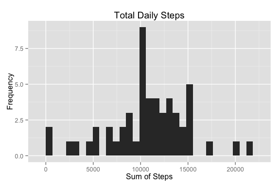
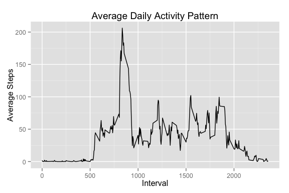
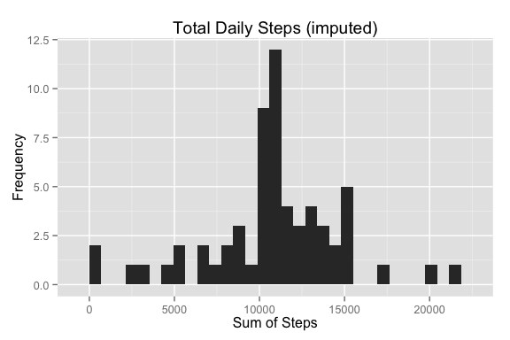
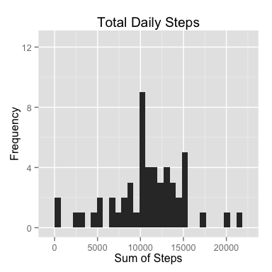
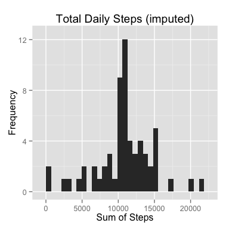
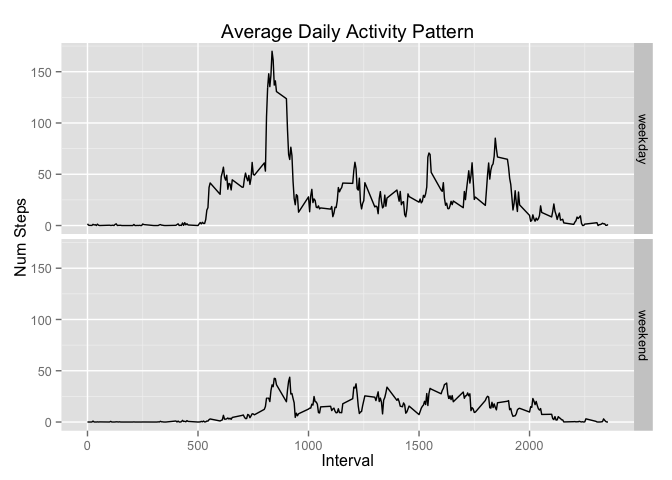

# Reproducible Research: Peer Assessment 1

## Install and Load Libraries

```r
# Auto Install Packages
list.of.packages <- c("dplyr", "ggplot2", "knitr")
new.packages <- list.of.packages[!(list.of.packages %in% installed.packages()[,"Package"])]

if(length(new.packages)) install.packages(new.packages)

## Bring in the libs.
library(dplyr)
library(ggplot2)
library(knitr)

## Knitr setup for rounding:
options(scipen = 1, digits = 1)
```

## Loading and preprocessing the data

```r
    # Load the data from CSV
    activity <- read.csv((unz("activity.zip", "activity.csv")))
    
    # Turn the date column into actual dates.    
    activity <- activity %>%
        mutate(date = as.Date(date))

    # Create a clean activity data frame, 
    # excluding missing values for later use.
    clean_activity <- filter(activity, !is.na(steps))
```


## What is mean total number of steps taken per day?
#### 1. Calculate the total number of steps taken per day

```r
    total_da <- clean_activity %>%
        group_by(date) %>%
        summarise(sumSteps = sum(steps))    

    #kable(daily_activity, digits=3, row.names = FALSE, format="html")
```

#### 2. Make a histogram of the total number of steps taken each day


```r
    sumStepsHistogram <- ggplot(data = total_da, aes(sumSteps)) + 
        labs(
            title="Total Daily Steps",
            x = "Sum of Steps",
            y = "Frequency"
        ) + 
        geom_histogram()

    print(sumStepsHistogram)
```

 

#### 3. Calculate and report the mean and median of the total number of steps taken per day


```r
    mean_steps <- mean(total_da$sumSteps, na.rm = TRUE)
    median_steps <- median(total_da$sumSteps, na.rm = TRUE)
```

##### Mean Steps Taken Per Day: 
There were **10766.2** steps taken per day.

##### Median Steps Per Day
There were **10765** steps taken per day.


## What is the average daily activity pattern?

#### 1. Make a time series plot (i.e. type = "l") of the 5-minute interval (x-axis) and the average number of steps taken, averaged across all days (y-axis)


```r
    n_days <- count(clean_activity, interval)

    activity_pattern <- clean_activity %>%
        group_by(interval) %>%
        summarise(sum_steps = sum(steps, na.rm = TRUE)) %>%
        inner_join(n_days, c("interval")) %>%
        mutate(avg_steps = sum_steps / n)

    ## Using ggplot2, since assignment allows using any plotting system.
    g <- ggplot(
            data = activity_pattern, 
            aes(x = interval, y = avg_steps)
        ) + 
        labs(
            title = "Average Daily Activity Pattern",
            x = "Interval",
            y = "Average Steps Per Interval"
        ) + 
        geom_line()
    print(g)
```

 

#### 2. Which 5-minute interval, on average across all the days in the dataset, contains the maximum number of steps?

```r
    ap_ordered <- arrange(activity_pattern, desc(avg_steps))
    ap_high_interval <- ap_ordered[1, 1]
    ap_high_interval_steps <- ap_ordered[1, 4]
```

The 5 minute interval **835** has the highest number of average steps per day, with **206.2** average steps per interval. 

## Imputing missing values

Note that there are a number of days/intervals where there are missing values (coded as NA). The presence of missing days may introduce bias into some calculations or summaries of the data.

#### 1. Calculate and report the total number of missing values in the dataset (i.e. the total number of rows with NAs)


```r
missing_values <- activity[!complete.cases(activity), ]
total_bad <- nrow(missing_values)
```

There are a total of **2304** missing values in the dataset.


#### 2. Devise a strategy for filling in all of the missing values in the dataset. The strategy does not need to be sophisticated. For example, you could use the mean/median for that day, or the mean for that 5-minute interval, etc.

**I have chosen the strategy that consists of replacing missing values with the means for that interval across all the days available.** 

#### 3. Create a new dataset that is equal to the original dataset but with the missing data filled in.

```r
# Grab the means for each interval across all days
# from the activity_pattern variable.
interval_means <- select(
    activity_pattern, 
    interval, 
    steps = avg_steps
)

# Grab only the date and interval column from the missing_values 
# variable created above.
nas_only <- select(missing_values, date, interval)

# Join them together
fixed_nas <- inner_join(interval_means, nas_only, by="interval")

# Add the imputed data to clean activity.
activity_i <- bind_rows(clean_activity, fixed_nas)
```

#### 4. Make a histogram of the total number of steps taken each day and Calculate and report the mean and median total number of steps taken per day. Do these values differ from the estimates from the first part of the assignment? What is the impact of imputing missing data on the estimates of the total daily number of steps?


```r
    # Do the total steps calculation based on the new imputed activity.
    daily_activity_i <- activity_i %>%
        group_by(date) %>%
        summarise(sumSteps = sum(steps))    

    sumStepsImputedHistogram <- ggplot(
        data =daily_activity_i, aes(sumSteps)
    ) + 
    labs(
        title="Total Daily Steps (imputed)",
        x = "Sum of Steps",
        y = "Frequency"
    ) + 
    geom_histogram()

    print(sumStepsImputedHistogram)
```

 


```r
    mean_steps_i <- mean(daily_activity_i$sumSteps)
    median_steps_i<- median(daily_activity_i$sumSteps)
```

##### Mean Steps Taken Per Day: 
There were **10766.2** steps taken per day.

##### Median Steps Per Day
There were **10766.2** steps taken per day.

#### Comparison - Imputed Dataset Vs Non-Imputed:





<div style="clear: both;"></div>

|   |Original|Imputed|
|---|---|---|
|Mean   |10766.2   |10766.2   |
|Median   |10765   |10766.2   |

It seems like using the means to impute the missing data maintained the pattern shown without missing data, but in the histogram, frequency increased as can be seen in the charts above.


## Are there differences in activity patterns between weekdays and weekends?
For this part the weekdays() function may be of some help here. Use the dataset with the filled-in missing values for this part.

#### 1. Create a new factor variable in the dataset with two levels – “weekday” and “weekend” indicating whether a given date is a weekday or weekend day.


```r
weekday_or_weekend <- Vectorize(function(date) {
    day_of_week <- weekdays(date)
    # Assume weekday
    result <- "weekday"      
    if (day_of_week == "Saturday" || day_of_week == "Sunday")
        result <- "weekend"
    
    result
})

activity_iw <- mutate(
    activity_i, 
    day_of_week = as.factor(weekday_or_weekend(date))
)
```

#### 2. Make a panel plot containing a time series plot (i.e. type = "l") of the 5-minute interval (x-axis) and the average number of steps taken, averaged across all weekday days or weekend days (y-axis). 


```r
    # Get # of days containing interval
    n_days <- count(activity_i, interval)
   
    dow_pattern <- activity_iw %>%
        group_by(interval, day_of_week) %>%
        summarise(sum_steps = sum(steps)) %>%
        inner_join(n_days, c("interval")) %>%
        mutate(avg_steps = sum_steps / n)

    g <- ggplot(
            data = dow_pattern, 
            aes(x = interval, y = avg_steps)
        ) + 
        labs(
            title = "Average Daily Activity Pattern",
            x = "Interval",
            y = "Num Steps"
        ) + 
        geom_line() +
        facet_grid(day_of_week ~ .)
    print(g)
```

 
